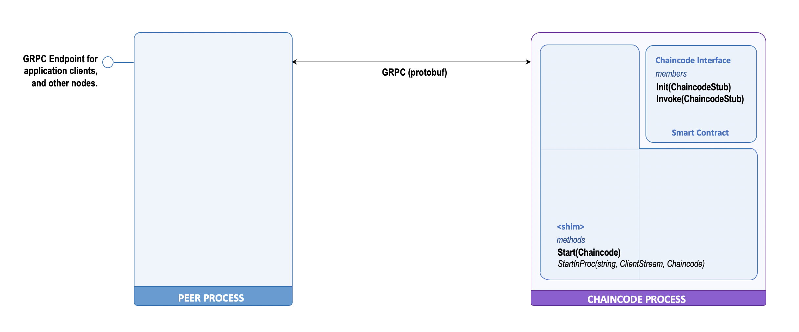

# Chaincode Execution Model

Hyperledger Fabric manages and executes the smart contract deployed through the chaincode as a remote process that interacts with peer via [gRPC](https://grpc.io/). This separation of execution environments provides a variety of advantages:

- __Language / tech stack independence__: by running the chaincode as a separate process there are far less constraints on the language and tech stack used to write smart contract and the runtime it needs. The interaction point here is defined by the  of gRPC services and messages used by the two processes to interact. Currently, this is what enables the Hyperledger Fabric to support other than Golang, both Node and Java as programming languages for smart contract development.
- __Failure isolation__: by running the chaincode as a separate process it is possible to constrain the failures (i.e. critical execution errors) to the runtime environemnt associated to that process, without affecting substantially the functionality of the peer. This is particular important, if you think at the smart contract as a plugin that his developed by third parties and it is installed and executed in the Fabric Peer.
- __Deployment flexibility__: by running the chaincode as a process we can leverage a variety of deployment models that do not necessarily impose co-location with the peer, the only requirement is for the chaincode and the peer to be able to interact via gRPC. This in principle opens up the possibility to run the chaincode as local OS process, a remote  process,  a Docker container or any other form of process virtualisation. The current approach is to run it as Docker container.
- __Modular development__:  separating out the execution of the chaincode into a distinct networked components, increases the modularity of the system as it decouples the chaincode from the peer. This has not only implications on the deployment but also separates out the development of the two. New improvements can be done on the chaincode runtime support implementation without affecting the peer. As a matter of facts, all the chaincode process implementations exist as distinct projects and as a separate repositories, from the Hyperledger Fabric repository.
- __Separation of concerns__: this approach also allows to separate what are the functions that are stricly related to the management of the chaincode and the smart contract hosted within it, from the rest of the platform.

In order to simplify the life of smart contract developer and focus their effort on the development of the smart contract logic, Hyperledger provides developers with _chaincode shims_. These are implementation of the runtime environment needed to integrate the smart contract with Hyperledger Fabric and execute them as remote processes.

The shim is the component that is responsible to run the smart contract, make it accessible to the peer, manage all the low-level interaction with it via gRPC. Moreover, it provides a simplified interface to the smart contract to access the ledger and chaincode invocation services via _chaincode stub_.

The figure below, provides a very high-level view of the peer-chaincode interaction.

