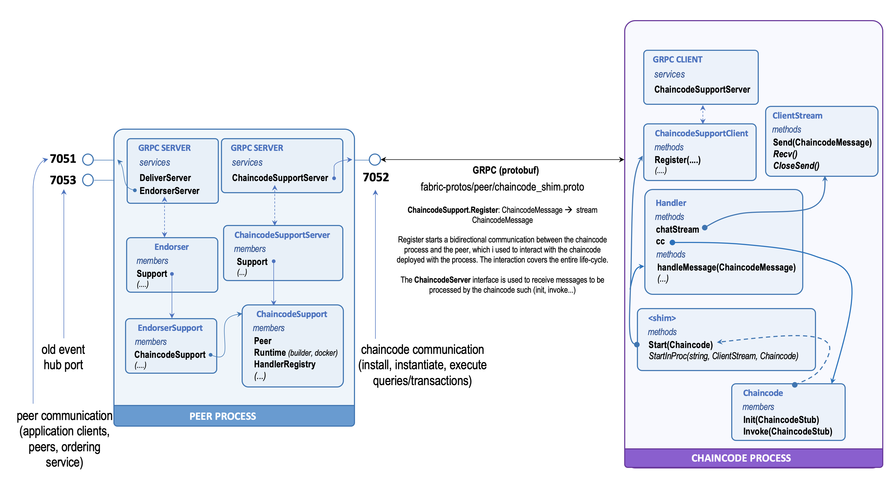

# Key Components

The figure below  provides an overview of the principal components that are involved in the interaction between the  chaincode process and the peer.



The protocol is implemented as an exchange of GRPC messages between the GRPC server on the peer and the GRPC client in the chaincode process. The GRPC server exposes the `ChaincodeSupport` service. The protobuf definition  of this service is found in the [chaincode_shim.proto](https://github.com/hyperledger/fabric/blob/release-1.4/protos/peer/chaincode_shim.proto) file in the hyperledger fabric distribution repository. The service exposes only one method `Register` which opens a bidirectional stream between the chaincode and the peer. This is the channel where the exchange of messages happens.

!!! Note
    This interaction modality is also called _chaincode as client_, which is the only interaction mode available until Hyperledger Fabric 2.0. The implementation of the fabric shim for go chaincode also allows the initialisation of the chaincode process as a server in the message exchange between the two. This modality is known as _chaincode as server_ but it is not in use until version 2.0 of Hyperledger Fabric.

## Peer Components

In the peer, the `ChaincodeSupport` service is mapped to the `ChaincodeSupportServer` interface. This is implemented by the [ChaincodeSupport](https://github.com/hyperledger/fabric/blob/release-1.4/core/chaincode/chaincode_support.go) struct, which is the point of connection between the other components of the peers and the communication channel with the chaincode process.

The `ChaincodeSupport` struct manages the connection and the interaction with all the chaincode processes. The listing below shows the attribute the struct.

```go
type ChaincodeSupport struct {
    Keepalive        time.Duration
    ExecuteTimeout   time.Duration
    UserRunsCC       bool
    Runtime          Runtime
    ACLProvider      ACLProvider
    HandlerRegistry  *HandlerRegistry
    Launcher         Launcher
    SystemCCProvider sysccprovider.SystemChaincodeProvider
    Lifecycle        Lifecycle
    appConfig        ApplicationConfigRetriever
    HandlerMetrics   *HandlerMetrics
    LaunchMetrics    *LaunchMetrics
}
```

This struct is the main entry point for the management of the chaincode processes within the peer. There are three main functions that this component performs:

- __Chaincode Runtime Environment Management__: this means building, starting up, and managing the runtime environment where the smart contract are executed (i.e. [Runime](https://github.com/hyperledger/fabric/blob/release-1.4/core/chaincode/chaincode_support.go#L27) and [Launcher](https://github.com/hyperledger/fabric/blob/release-1.4/core/chaincode/chaincode_support.go#L34)). 
- __Chaincode Interaction Protocol Management__: this entails management of the connection with the chaincode processes and implementing the interaction protocol. Most of the functionalities are managed by the collection of [Handler](https://github.com/hyperledger/fabric/blob/release-1.4/core/chaincode/handler.go#L121) instances, one per chaincode process, that provide services to the smart contract such as ledger access and cross-chaincode invocations.
- __Transaction Simulation__: this entails forwarding transaction proposals to the appropriate chaincode process along with the required channel context to allow the smart contract to simulate the execution and provide results. Again, this capability is delegated to the associated `Handler` that manages the interaction with a specific chaincode process.

Transactions simulations are initiated by application clients that submit transaction proposal through the `EndorserServer` GRPC service. The code listing below shows the details of the protobuf definition. The service has only one method `ProcessProposal(....)`.

```Protobuf
   service Endorser {
      rpc ProcessProposal(SignedProposal) returns (ProposalResponse) {}
   }
```

The bindings for this service are represented by the [Endorser](https://github.com/hyperledger/fabric/blob/release-1.4/core/endorser/endorser.go#L103) component. This component coordinates the execution of the transaction simulation by interacting with the `ChaincodeSupport` instance previously discussed.

!!!Note
   As shown in the figure the `Endorser` has a `Support` component which is the liason to the `ChaincodeSupport` instance previously discussed.

For more details about these components see the [Peer Architecture](../peer-architecture/index.md) section.

## Chaincode Components

The chaincode process contain a shim (i.e. [shim.go](https://github.com/hyperledger/fabric-chaincode-go/blob/master/shim/shim.go)), which is the main driver of the process and it is responsible for the coordination with the peer. The shim is initialised with an implementation of the `Chaincode` interface, which represents the smart contract hosted and executed in the process.

The connectivity with the peer is managed by the GRPC client which is used to retrieve a bidirectional stream used by the [Handler](https://github.com/hyperledger/fabric-chaincode-go/blob/master/shim/handler.go#L37). This component implements the interaction protocol with the peer and exchange `ChaincodeMessage` instances as a result of:

- the invocation of transactions by the peer; and
- ledger queries or cross chaincode invocations by the smart contract.

For more details about these components see the [Shim Architecture](../shim-architecture/index.md) section.
