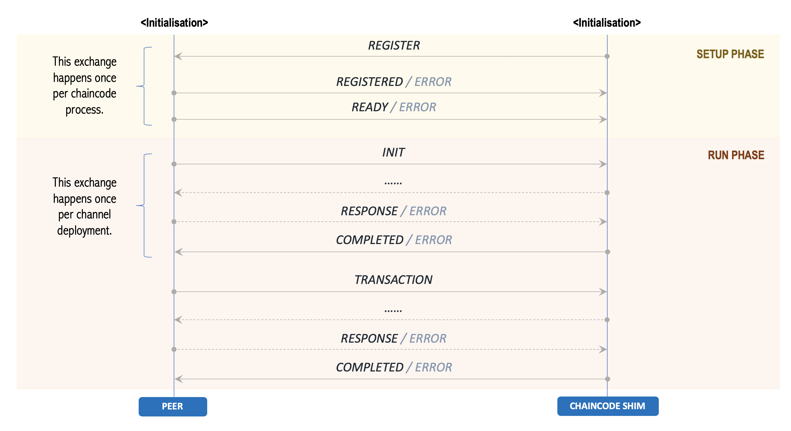
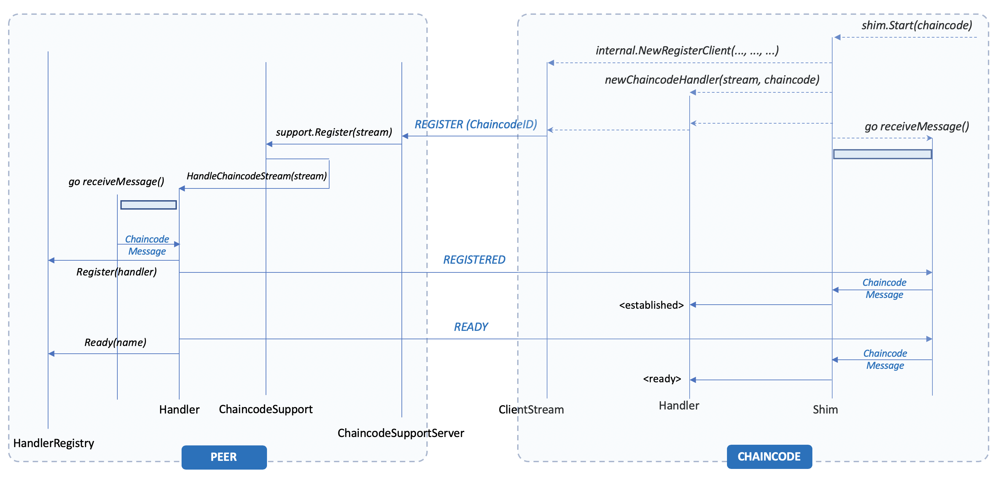
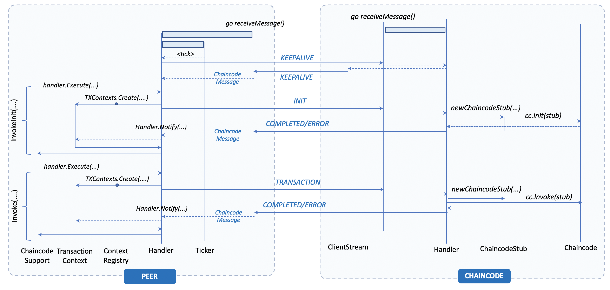
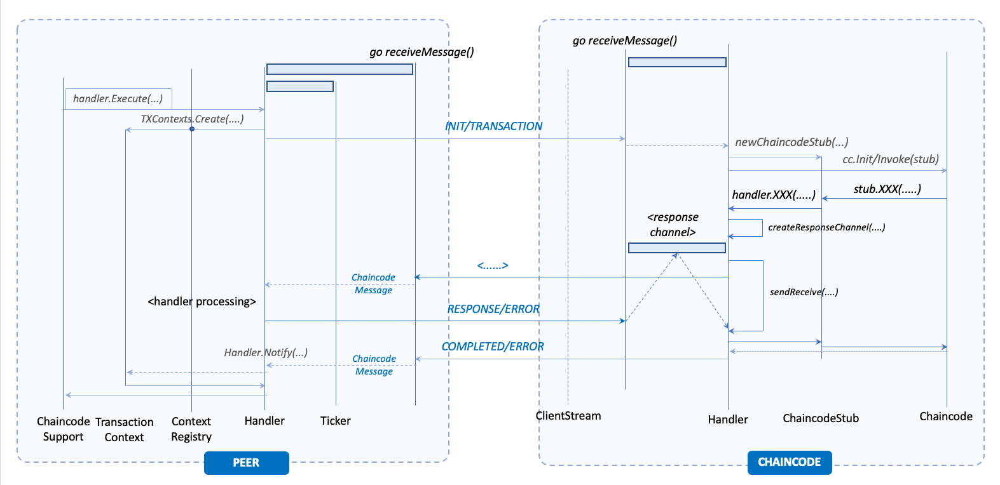

# Interaction Lifecycle

The interaction protocol is completely based on the exchange of [Protobuf](https://developers.google.com/protocol-buffers) messages between the chaincode process and the peer. The exchanged messages are of type `ChaincodeMessage` and defined in  the [chaincode_shim.proto](https://github.com/hyperledger/fabric-protos/blob/master/peer/chaincode_shim.proto) file of the fabric-protos repository. The advantage of using Protobuf is to decouple the semantic from the implementation.

The figure above provides an overview of the interaction protocol end-to-end. The lifecycle of the interaction develops in three phases: initialisation, setup, and transaction execution (or run phase). More details for each of the phases will be provided in the corresponding sections.

## Message Structure

The table below provides an overview of the structure of the message. The design rationale is  to use a single type of message whose type determines how to interpret and cast the payload. Different types of messages are used to express and convey the information needed for each of the operations supported by the protocol.

| Attribute Name   | Type                       | Meaning                                      | Optional | Comments                                               |
:------------------|:---------------------------|:---------------------------------------------|:--------:|:-------------------------------------------------------|
| type             | enum                       | type of message                              | no       |                                                        |
| timestamp        | google.protobuf.Timestamp  | timestamp                                    | no       | message creation time                                  |
| txid             | string                     | transaction identifier                       | yes      |                                                        |
| payload          | byte[]                     | message payload                              | yes      | contains different information based on type           |
| proposal         | SignedProposal             | signed transaction proposal                  | yes      | contains the transaction proposal to simulate          |
| chaincode_event  | ChaincoodeEvent            | chaincode event to be raised at commit time  | yes      | set by the chaincode shim if events need to be raised  |
| channel_id       | string                     | channel unique identifier                    | yes      | specifies the channel the transaction belongs to       |

!!! Note
    The types `ChaincodeEvent` and `SignedProposal` are defined in the files `chaincoode_event.proto` and `proposal.proto` in the same repository.

## Phase 1: Initialisation

### Peer Initialisation

The peer node is made up by several sub-systems that collectively provide services to the Hyperledger Fabric network (see: [Peer Architecture](../peer-architecture/index.md) for more details). In this context we focus on those components that are relevant to the interaction with the chaincode process. The following steps are executed:

- `PlatformRegistry` initialisation: this component provide saccess to the chaincode builsing and launching services for supported stacks (i.e. golang, jvascript, java, ...).
- `ChaincodeProvider` iniitialisation: this component provides access to the chaincode packaging capability (primarily transaction execution).
- `ChaincodeSupport` initialisation: thhis component porivde access to the chaincode services at the peer level.
- `ChaincodeSupportServer` initialisation: this component is the GRPC server that exposes the `ChaincodeSupport` service and accepts the connection from the chaincode processes.
- `EndorserServer` initialisation: this component is the GRPC server that exposes the `EndorserSupport` service which receives transaction proposal for endorsement.

The endorsement entails the execution of a transaction simulation in one of the connected chaincode processes.

### Shim Initialisation

The driver process of the shim loads the chaincode by invoking `shim.Start(Chaincode)`. This method performs the following operations:

- GRPC client initialisation: this is used to connect to the peer and setup a bidirectional stream to exchange `ChaincodeMessage` instances.
- `Handler` initialisation: this component is in charge of processing all the messages sent by the peer and execute the associate operations.
- Messaging processing loop initialisation: this message loop is used to receive the messages from the peer and dispatch them to the handler for further processing.

This initialisation modality support the _chaincode-as-client_ pattern, where the chaincode process is a client to the peer. The shim also has the capability to initialise itself to support the _chaincode_as_server_ pattern, where the roles are reversed. This is done by initialising a new [ChaincodeServer](https://github.com/hyperledger/fabric-chaincode-go/blob/master/shim/chaincodeserver.go) instance with the details of the chaincode and invoke the method `ChaincodeServer.Start()`.

## Phase 2: Communication Setup

- Before starting the messaging processing loop the shim sends a `REGISTER` message through the bidirectional stream opened with the peer. This message contains the details of the chaincode to register codified as a `ChaincodeID` in the payload.
- Upon reception of the message, the peer validates the information associated to the chaincode and allocates an `Handler` instance to manage the message exchange with the chaincode process.
- The peer then responds with a `REGISTERED` message and immediately after with a `READY` message, signaling the completion of the setup process.

The figure below shows the exchange of messages during the setup phase, with reference to the chaincode shim implemented in Go.

## Phase 3: Transaction Execution

Once the setup phase is complete the chaincode and peer are ready to run transactions. From this point onward the interaction is driven by the peer, as a result of the operations that are submitted ted by the application clients to the peer. These usually involve the deployment of the chaincode onto a specific channel and the subsequent invocation of transactions on the deployed smart contract.

This interaction is implemented in the following steps:

- As a result of a chaincode deployment, the peer sends an `INIT` message. This operation is triggered by the invocation of the `ChaincodeSupport.InvokeInit(...)` method, which calls the `Handler.Execute(...)` method on the instance that is mapped to the chaincode being invoked. The handle initialises a Transaction Context for the simulation of the transaction proposal associated to the initialisation and sends the message through bidirectional stream.
- Upon reception of the `INIT` message the message receiving loop dispatches the message to the `Handler`. This in turn creates a new `ChaincodeStub` instance, which represents the interface to the peer services exposed to the smart contract, and invokes `Chaincode.Init(...)` by passing the stub as argument. This invocation is executed in a separate go-routine, thus preventing the chaincode from blocking the message receiving loop.
- The chaincode executes the initialisation of the initialisation of the smart contract and the `Init(...)` method completes either successfully or with an error. The former causes a `COMPLETED` message to be sent back to the peer, while the latter triggers an `ERROR` message.
- Upon reception of the message, the message receiving loop of the peer invokes the `Handler.Notify(...)` method on the instance associated to the chaincode process. This method closes the previously open transaction context and causes the `Handler.Execute(...)` method to unblock and return the response obtained by the chaincode to the caller.
  
Subsequent invocations of the same chaincode in the same channel, result in the peer sending a `TRANSACTION` message, which is handled in the same manner as detailed for the `INIT` message. The figure below summarises the interactions among components that happens both within the peer and the chaincode shim.

Occasionally, and if configured to do so, the peer sends `KEEP_ALIVE` messages that the chaincode process simply replies to, to ensure that the shim is still alive. This is particularly relevant in a deployment where the transactions are infrequent.

The processing of an `INIT` or `TRANSACTION` message, may require the chaincode process to access the ledger or invoke another chaincode onto the same peer. This results in one or more messages sent back to the peer within the context of the communication established by the `INIT` or `TRANSACTION` message. The figure below shows how the previous interaction changes in case of talk-backs.

The communication back to the peer is exercised by invoking one of the methods exposed by the `ChaincodeStubInterface` and implemented in the `ChaincodeStub`. For those methods that require a talk back the `Handler` sets up a _response channel_ which is used by the current go-routine processing the original `INIT` or `TRANSACTION` method to send the message to the peer and wait for the response.  The specific type and payload of the message sent to the peer depends upon the method that has been invoked on the stub (for more details see the [Message Types](messages.md) section).

On the peer side, when the message is received the corresponding operation is performed and the result is sent back through a `RESPONSE` (or `ERROR`) message. This message is picked up by the message receiving loop of the chaincode shim, which dispatches it to the `Handleer`. By using the information in the message, the handler selects the associated response channel and sends the message through it, thus unblocking the waiting go-routine that can now continue its processing with the received results.

The figure shows only one communication back to the peer, but this process can be executed multiple times. One for any invocation on the `ChaincodeStubInterface` that requires talking back to the peer. Once the smart contract has completed the processing a `COMPLETED` (or `ERROR`) message willn be sent back to the peer, thus terminating the transaction simulation.
