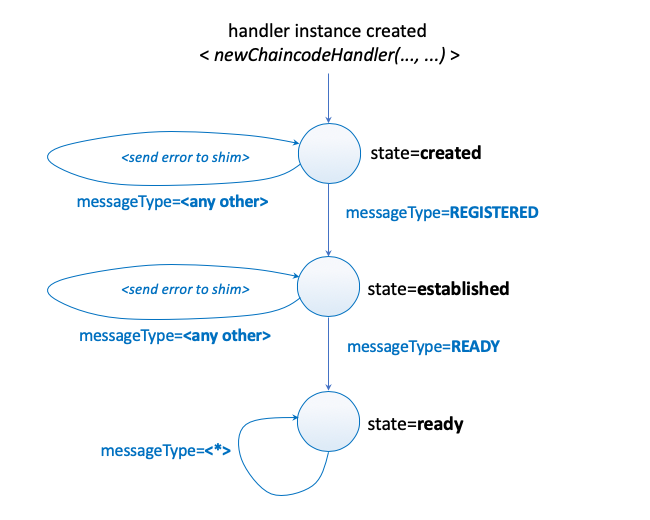

# Handler

The chaincode handler is responsible for managing the entire communication protocol with the peer (from the initialisation of the communication to the end) and ultimately for invoking the `Chaincode` interface methods on the configured implementation.

More specifically, the responsibilities of the handler are:

- `ChaincodeMessage` packing and unpacking;
- concurrency management to support multiple transaction execution at the same time;
- chaincode implementation life-cycle management (register, initialise, and execute);
- recreation of the transaction context required to invoke smart contract methods; and
- request forwarding from the chaincode implementation to the peer (i.e. ledger queries and cross-chaincode invocations).

The handler is defined in the [handler.go](https://github.com/hyperledger/fabric-chaincode-go/blob/master/shim/handler.go).

## Execution Model

The handler exists a single instance in in the shim and it is implemented as a state machine that follows the life-cycle of the chaincode. The state evolution is shown in the figure below and it is driven by the messages received from the peer.



There are three states that define the behaviour of the handler: _created_, _established_, and _ready_. The state of the handler determines the type of messages that it expects from the peer for a correct interaction protocol.

## Initialisation

A new instance of the handler is created by [shim](shim.md) during setup, via the  `newChaincodeHandler(stream PeerChaincodeStream, cc Chaincode)` method. This method configures the handler with the `Chaincode` implementation, the bidirectional stream, and also initialises the internal data structure required by the handler to operate.

The invocation of the method returns a pointer to the `Handler` struct that is shown in the listing below. Upon creation the handler is set to the `created` state.

```go
type Handler struct {

    // used to serialise the access to the stream
    // and synchronise concurrent writes
    serialLock sync.Mutex

    // bidirectional stream open with the peer configured
    // to exchange pb.ChaincodeMessage instances
    chatStream PeerChaincodeStream

    // chaincode implementation
    cc Chaincode

    // state of the handler
    state state

    // used to serialise updates to the responseChannels
    // map that keep tracks of the chaincode requests to
    // the peer that are currently in flight
    responseChannelsMutex sync.Muttex

    // keeps track of the chaincode requests to the peer
    // currently in flight. For each transaction there is
    // an expectation that at most one request at the time
    // will be active
    responseChannels map[string]chan pb.ChaincodeMessage
}

```

## Functionalities

The `Handler` struct is bound to methods that cater for four distinct capabilities.

### Sending and Receiving Messages

- `serialSend(msg *pb.ChaincodeMessage)`
- `serialSendAsync(msg *pb.ChaincodeMessage, errc <- chan error)`
- `sendReceive(msg *pb.ChaincodeMessage, responseChan <- chan pb.ChaincodeMessage)`

### Processing Messages from the Peer

- `handleXXX(msg *pb.ChaincodeMessage)`
- `handleStubInteraction(..., *pb.ChaincodeMessage)`
  
### Processing Request/Responses from the Stub

- `handleXXX(....)` - in this case the argument is not a `pb.ChaincodeMessage`
- `createResponse(status int32, payload []byte)`
  
### Managing Response Channels

- `createResponseChannel(channelID string, txid string)`
- `deleteResponseChannel(channelID string, txid string)`
