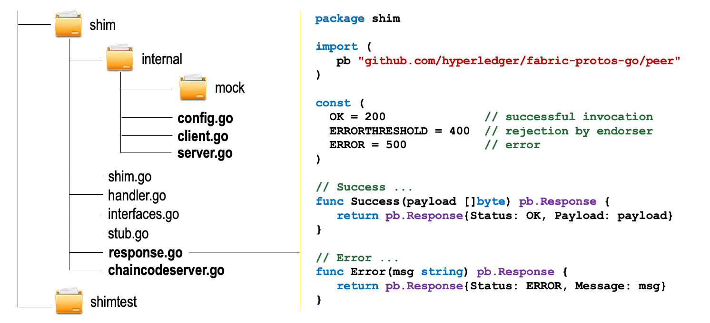

# Other Components

The figure below provides an overview of the remaining components that make up the fabric shim highlighted in __bold__. The figure also shows the implementation of the [response.go](https://github.com/hyperledger/fabric-chaincode-go/blob/master/shim/response.go) file that contains the deifinition of constants and helper functions that are used to create success and error responses by the chaincode developers.

The rest of the files cover:

- __Configuration Management__ (i.e. [config.go](https://github.com/hyperledger/fabric-chaincode-go/blob/master/shim/internal/config.go)): this will be discussed in more detail in the section [Securing the Chaincode Process](../security.md) section.
- __GRPC Client-server Communication__ (i.e. [client.go](https://github.com/hyperledger/fabric-chaincode-go/blob/master/shim/internal/client.go) and [server.go](https://github.com/hyperledger/fabric-chaincode-go/blob/master/shim/internal/server.go))
- __Chaincode Execution as Server__ (i.e. [chaincodeserver.go](https://github.com/hyperledger/fabric-chaincode-go/blob/master/shim/chaincodeserver.go)): this will be discussed in more detail in the [Chaincode Execution Patterns](../execution-patterns.md) section.
