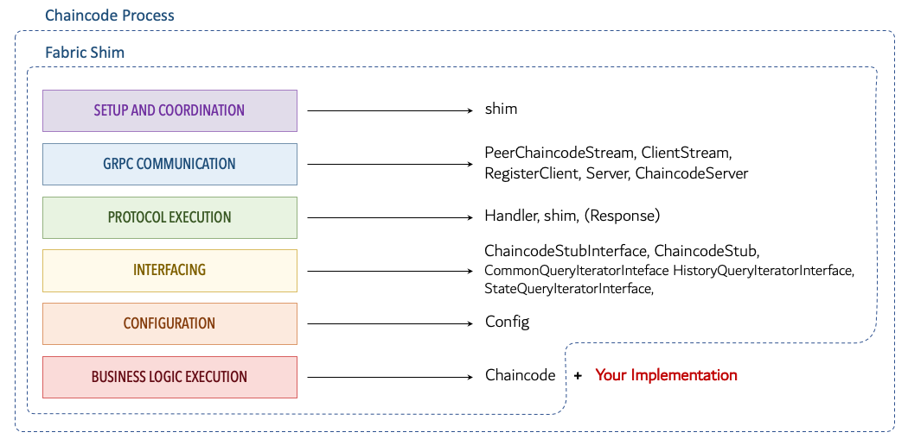

# Fabric Chaincode Shim Architecture

The figure below provides breakdown of the components that make up the chaincode process together with the role and responsibilities that each of the components have. It is worth noting, that while the shim is a specific component of the chaincode process, unless differently specified the shim is also used to refer to the set of components that make up the chaincode process _except_ for the implementation of the chaincode interface, which represents the smart contract implemented by the developer.

!!! Note
    The diagram provides a breakdown of the components with a particular reference to the chaincode shim written in Golang (i.e. [fabric-chaincode-go](https://github.com/hyperledger/fabric-chaincode-go)). These components can also be found in other implementations of the shim with minor differences.

The main function of the chaincode process are:

- __Setup and Coordination__: this function is performed by the `shim` package which acts as main driver for the chaincode process.
- __GRPC Communication__: this function refers to the low-level interaction, connection setup, and management of the bidirectional stream with the peer. The components responsible for this function are: `PeerChaincodeStream`, `ClientStream`, `RegisterClient`, `Server` and `ChaincodeServer`.
- __Protocol Execution__: this function covers the message echange with the peer, the manageement of the message receiving loop, the processing of messages, and the management of go-routines for asynchronous transaction simulation execution. The `Handler` is the component that does the heavy-lifting here, with support from the coordination logic implemented in the `shim.Start(Chaincode)` method.
- __Interfacing__: this function covers the interaction with the smart contract hosted in the chaincode process. The `ChaincodeStubInteface` defines the services exposed to the smart contract. These are implemented in the `ChaincodeStub` component, which acts as a liason between the smart contract the handler. The stub is also responsible for providing implementations of iterators for various types of range queries, which are access through the following interfaces: `CommonQueryIteratorInterface`, `StateQueryIteratorInterface`, and `HistoryQueryIteratorInterface`.
- __Configuration__: groups all the capabilities for customising and configuring the execution of the chaincode process. In particular, it provides information about the peer and the security settings for the communication via the `Config` component.
- __Contract Business Logic__: this function is exposed to the chaincode process via the `Chaincode` interface, which is implemented by the smart contract. The smart contract is the only component that is external to the shim.

In the next section, we will be detailing the functions and the imnplementation of each of these components.
