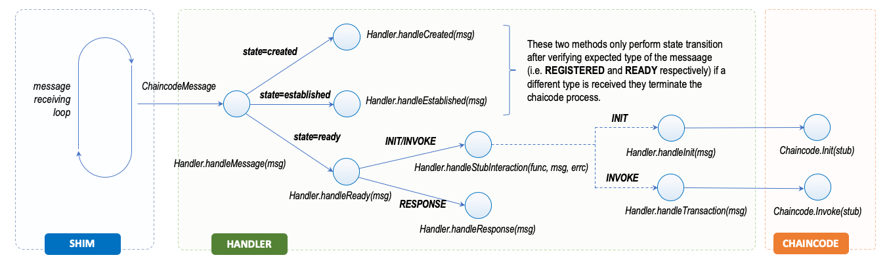

# General Interaction Flow

The figure below shows the interaction flow between the [shim](../components/shim.md), the [Handler](../components/handler.md) and the `Chaincode` implementation during the processing of a transaction proposal. The message loop implemented in the `chatWithPeer(....)` method dispatches the message to the handler, which based on its state processes it. The most relevant path for this flows is the happening when the `Handler` is in the `ready` state and processes either transaction invocations via the [handleStubInteraction(func(...), *ChaincodeMessage, chan<- error)](https://github.com/hyperledger/fabric-chaincode-go/blob/master/shim/handler.go#L158) method or responses to peer request by the chaincode via the [handleResponse(*ChaincodeMessage)](https://github.com/hyperledger/fabric-chaincode-go/blob/master/shim/handler.go#L115) method.

This is a high-level overview of the interaction inside the chaincocde process. In this section we will be covering the details of this interaction that allow for:

- concurrent processing of multiple transaction proposals; and
- communication back ton the peer for ledger request and cross-chaincode invocation.

In particular we will be discussing the concucrrency model that enabling this behaviour and discuss some insights on the expected properties of the `Chaincode` implementation that this model requires for its correct operations.
