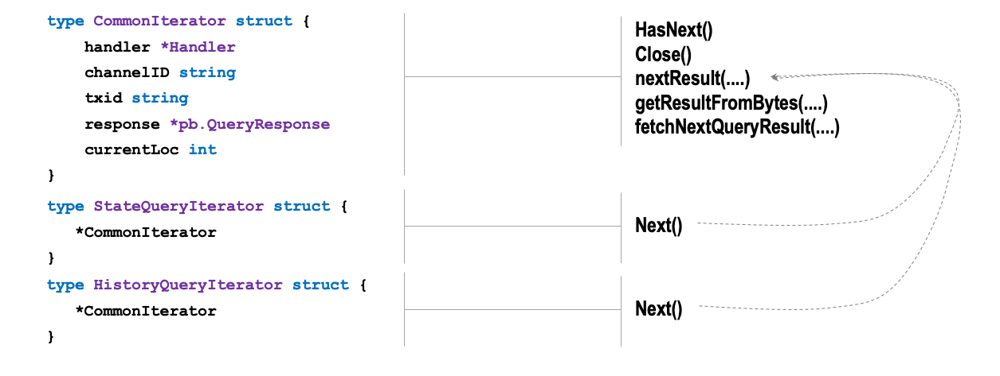
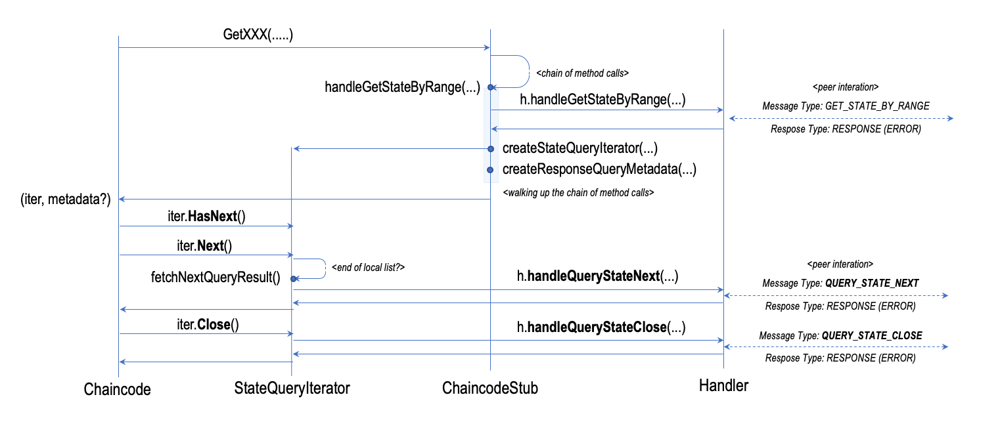

# Range Queries and Iterators

## Overview

The `ChaincodeStubInterface` exposes several methods that allow smart contract developers to retrieve a sequence of entries. This capability is quite useful as it allows, for instance, the iteration of a range of keys that match a certain criteria or retrieval of the historical changes made to the value associatedd to a key.

The implementation of this capability relies on _iterators_. These rely upon the already described method for [issuing requests to the peer](talk-backs.md) but may involve multiple requests made to optimise the bandwidth and the consumption of network resources.

## Implementation

Three different types of iterators are defined:

- `CommonIteratorInterface`: this interface defines the common operations of all types of iterators.
- `StateQueryIteratorInterface`: this interface specialises the base iterator interface to iterate over a collection of keys in the ledger.
- `HistoryQueryIteratorInterface`: this interface specialises the base iterator interface to iterate over the history of changes of a key.

The listing below shows the definition of the iterator interfaces and the following table maps the `ChaincodeStubInterface` methods to the corresponding iterators that are returned by such methods.

```go
type CommonIteratorInterface interface {
   HasNext() bool
   Close() error
}

type  {
    CommonIteratorInterface
    Next() (*queryresult.KV, error)
}

type HistoryQueryIteratorInterface {
    CommonIteratorInterface
    Next() (*queryresult.KyModification, error)
}
```

| ChaincodeStubInterface Method                |  Returned Iterator                  |
|:---------------------------------------------|:------------------------------------|
| GetStateByRange                              | StateQueryIteratorInterface         |
| GetStateByRangeWithPagination                | StateQueryIteratorInterface         |
| GetStateByPartialCompositeKey                | StateQueryIteratorInterface         |
| GetStateByPartialCompositeKeyWithPagination  | StateQueryIteratorInterface         |
| GetQueryResult                               | StateQueryIteratorInterface         |
| GetQueryResultWithPagination                 | StateQueryIteratorInterface         |
| GetPrivateDataByRange                        | StateQueryIteratorInterface         |
| GetPrivateDataByPartialCompositeKey          | StateQueryIteratorInterface         |
| GetPrivateDataQueryResult                    | StateQueryIteratorInterface         |
| GetHistoryForKey                             | HistoryQueryIteratorInterface       |

Most of the method use the `StateQueryIteratorInterface` as they provide different options to iterate over a collection of key in the world state (public and private). Only one method returns implementation of `HistoryQueryIteratorInterface`. These specialised interfaces of the `CommonIteratorInterface` only differ in the declaration of the return type of the `Next()` method. This is also reflected in the implementation of these interfaces that are defined in the [stub.go](https://github.com/hyperledger/fabric-chaincode-go/blob/master/shim/stub.go) file:

- __CommonQueryIterator__: implements all the common logic of the iterator and the interaction with the handler.
- __StateQueryIterator__: implements the `Next()` method to cast the returned struct to the `*queryresult.KV` type.
- __HistoryQueryIterator__: implements the `Next()` method to cast the returned struct to the `*queryresult.KeyModification` type.
  
The coordination of these three component with the `ChaincodeStub` provides support fo all the functions that return iterators.

The `ChaincodeStub` has the following responsibilities:

- prepare the information about the range to be queried, by adapting the parameters passed to the different methods that return iterators;
- invoke the corresponding `Handler` method to retrieve the first batch of data; and
- return the appropriate iterator implementation configured with the data that has been retrieved.

The iteration control logic is all implemented in the method that are bound to the `CommonIterator` struct, while the other two struct simply type casting.
The figure below provides an overview of the three structs and how the  method bounds to the different types relate to each other.



## Interaction Flow

The interaction flow with iterators starts from the `ChaincodeStub`, whose primaru responsibility is interfacing with the `Chaincode` implementation and expose a rich set of functions to query various elements in the ledger. From an implementation perspective all these functions are supported by three key methods:

- `ChaincodeStub.handleGetStateByRange(....)`
- `ChaincodeStub.handleGetQueryResult(....)`
- `ChaincodeStub.createQueryMetadata(....)`

Moreover, a set of utility methods support the management of key ranges and are used to prepare the information required by these methods.

### Iterating Over State Keys

The method `ChaincodeStub.handleGetStateByRange(....)` is the common denominator for all those methods that retrieves a collection of keys from the ledger. These are:

- `ChaincodeStubInterface.GetStateByRange(...)`
- `ChaincodeStubInterface.GetStateByRangeWithPagination(...)`
- `ChaincodeStubInterface.GetStateByPartialCompositeKey(...)`
- `ChaincodeStubInterface.GetStateByPartialCompositeKeyWithPagination(...)`
- `ChaincodeStubInterface.GetPrivateDataByRange(...)`
- `ChaincodeStubInterface.GetPrivateDataByPartialCompositeKey(...)`

This method invokes the corresponding function in the handler. This in turn sends a `ChaincodeMessage` of type `GET_STATE_BY_RANGE` configured with the required parameters to instruct the peer what to query. The listing below shows the implementation of the method.

```go

func (s *ChaincodeStub) handleGetStateByRange(
    collection, startKey, endKey string,
    metadata []byte
) (StateQueryIteratorInterface, *pb.QueryResponseMetadata, error) {

   response, err := s.handler.handleGetStateByRange(collection, startKey, endKey, metadata, s.ChannelID, s.TxID)
   if err != nil {
      return nil, nil, err
   }
   iterator := s.createStateQueryIterator(response)

   responseMetadata, err := createQueryResponseMetadata(response.Metadata)
   if err != nil {
      return nil, nil, err
   }
   return iterator, responseMetadata, nil
}

```

The most of the execution of the logic is contained in the handler. The stub is responsible for creating the appropriate iterator and deserialising the `QueryResponseMetadata` which provides information about the records that have been fetched and the bookmark for the search.

### Executing Complex Queries

The execution of complex queries is implemented through `ChaincodeStub.handleGetQueryResult(...)` which supports the functionalities required by the following methods:

- `ChaincodeStubInterface.GetQueryResult(...)`
- `ChaincodeStubInterface.GetQueryResultWithPagination(...)`
- `GetPrivateDataQueryResult(...)`

The implementation invokes the corresponding function in the handler. This in turn sends a `ChaincodeMessage` of type `GET_QUERY_RESULT` to the peer configured with the repquired parameter to instruct the peer on what to query. The implementation of this method is essentially the same as the one that support queries by range.

```go
func (s *ChaincodeStub) handleGetQueryResult(
    collection, query string,
    metadata []byte
) (StateQueryIteratorInterface, *pb.QueryResponseMetadata, error) {

   response, err := s.handler.handleGetQueryResult(collection, query, metadata, s.ChannelID, s.TxID)
   if err != nil {
      return nil, nil, err
   }
   iterator := s.createStateQueryIterator(response)

   responseMetadata, err := createQueryResponseMetadata(response.Metadata)
   if err != nil {
      return nil, nil, err
   }
   return iterator, responseMetadata, nil
}

```

### Retrieving the History of a Key

The method `ChaincodeStub.GetHistoryForKey(...)` provides access to the history of changes of a specific key in the ledger. The `ChaincodeStubInterface` exposes only one version of this method and therefore the coordination logic for retrieval is implemented directly in this method. In this case, there is no query metadata to process because there is no explicit pagination support as in the other two cases.

```go
func (s *ChaincodeStub) GetHistoryForKey(key string) (StateQueryIteratorInterface, error) {

   response, err := s.handler.handleGetHistoryForKey(key, s.ChannelID, s.TxID)

   if err != nil {
      return nil, err
   }

   return &HistoryQueryIterator{CommonIterator: &CommonIterator{s.handler, s.ChannelID, s.TxID, response, 0}}, nil
}

```

This method invokes the corresponding method in the handler, which in turn sends a message  `GET_HISTORY_FOR_KEY` to the peer to retrieve the history associated to the specified key.

### Pagination Control

The figure below provides an overview of the iterator in action within the context of the chaincode process. The figure shows the case for querying the ledger state by range, and therefore the execution of `ChaincodeStub.handleGetStateByRange(...)` but the flow is essentially the same for all the other
methods that return iterators.



A normal iteration cycle includes the following:

- invoking `HasNext()` to verify whether there are more elements to process;
- in case there are invoking `Next()` to retrieve the next element; and
- in case there aren't, close the iterator by invoking `Close()`.

The first two operation can be repeated in sequence until the caller is satisfied with the value that have been returned of the iterator reaches the end of the range.

Internally, the iterator implementation feeds the caller with element from the local batch of data that has been pre-fetched. If the iterator has reached the last element of the local batch, the iterator invokes `fetchNextQueryResult()`, which in turn calls the method `Handler.handleNextQueryStateNext(...)` by passing to it the last key that has been retrieved. The handler utilises this information to create a `ChaincodeMessage` of type `QUERY_STATE_NEXT` to the peer to retrieve the next batch of items. The call to the handler method is blocking because the implementation uses `Handler.sendReceive(....)` and therefore it behaves as previously explained.

Similarly, closing an iterator triggers the invocation of `Handler.handleQueryStateClose(..)` which sends a message of type `QU?ERY_STATE_CLOSE` to the peer and instruct it release the resources allocated to serve the query.

The pagination control logic is fully implemented in the methods bound to the `CommonIterator` struct. Even the implementation of the `Next()` methods is controlled by the common iterator logic defined by `CommonIterator.nextResult(...)` which has a switch on type to handle the processing of the different types of data. The listing below shows the implementation of the relevant methods of the iterator.

```go
func (iter *CommonIterator) fetchNextQueryResult() error {
    response, err := iter.handler.handleQueryStateNext(iter.response.Id, iter.channelID, iter.txid)
    if err != nil {
        return err
    }
    iter.currentLoc = 0
    iter.response = response
    return nil
}

func (iter *CommonIterator) getResultFromBytes(queryResultBytes *pb.QueryResultBytes, rType resultType) (queryResult, error) {

    if rType == StateQueryResult {
        stateQueryResult := &queryresult.KV{}
        if err := proto.Unmarshal(queryResultBytes.ResultBytes, stateQueryResult); err != nil {
            return nil, fmt.Errorf("error unmarshaling result from bytes: %s", err)
        }
        return stateQueryResult, nil

    } else if rType == HistoryQueryResult {
        historyQueryResult := &queryresult.KeyModification{}
        if err := proto.Unmarshal(queryResultBytes.ResultBytes, historyQueryResult); err != nil {
            return nil, err
        }
        return historyQueryResult, nil
    }
    return nil, errors.New("wrong result type")
}

func (iter *CommonIterator) nextResult(rType resultType) (queryResult, error) {
    if iter.currentLoc < len(iter.response.Results) {
        // On valid access of an element from cached results
        queryResult, err := iter.getResultFromBytes(iter.response.Results[iter.currentLoc], rType)
        if err != nil {
            return nil, err
        }
        iter.currentLoc++

        if iter.currentLoc == len(iter.response.Results) && iter.response.HasMore {
            // On access of last item, pre-fetch to update HasMore flag
            if err = iter.fetchNextQueryResult(); err != nil {
                return nil, err
            }
        }

        return queryResult, err
    } else if !iter.response.HasMore {
        // On call to Next() without check of HasMore
        return nil, errors.New("no such key")
    }

    // should not fall through here
    // case: no cached results but HasMore is true.
    return nil, errors.New("invalid iterator state")
}
```

The method `nextResult(...)` is the one that controls the access to the local cache of elements and the iteration logic. It invokes `getNextResultFromBytes(...)` to deserialise the element to return into the right type, and pre-fetches the next batch of elements by invoking `fetchNextQueryResult(...)`.

## Observations

From the implementation of these method every method that provides access to iterators returns iterator implementations that partially retrieve the set of elements that match the searching criteria in the form of data pages. This is the implemented behaviour regardless of whether the smart contract develoeper has called a method `...WithPagination(...)`.

The question therefore arise on what is the difference between the paginated version and the non-paginated version of the same method. The first set of methods implement _explicit pagination_ while the second set of method rely upon _implicit pagination_. From an implementation perspective it is always useful to paginate large data sets, especially if there isn't a full consumption of the data in range. Methods that provide _explicit pagination_ provide the smart contract developers with more control on the navigation of the range of keys that are returned by the iterator. For instance, it allows them to skip elements more easily and to start the search from a given page.
