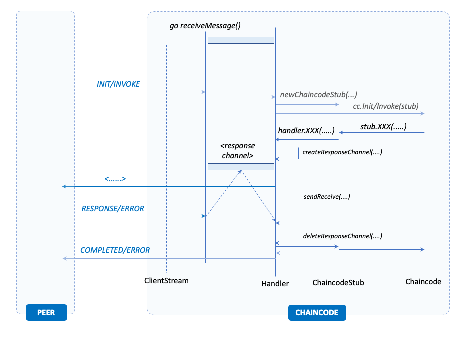

# Managing Talk-backs with the Peer

## Scope and Functionalities

A common requirement of the smart contract developers is to be able to query the ledger within the context of a transaction, either to reader from or write into it. The design of the smart contract is essentially stateless and therefore, any additional information that does not come with the chaincode arguments must be read from the ledger. The same goes for information that need to be persisted across transaction invocation that is not returned within a transaction proposal response payload.

Besides, accessing the ledger a smart contract may invoke another chaincode function deployed on the same peer. This invocation is mediated by the peer and therefore requires a communication back to it within the context of a single transaction invocation.

## Managing Response Channels

The communication  is coordinated through ad-hoc channels that are created for each interaction back to the peer. This coordination is responsibility of the `Handler` and it is implemented in the method `callPeerWithChaincodeMsg(...)` shown in the listing below. This method is the common denominator of all the functions that are exposed by the `ChaincodeStubInteface` that require interaction with the peer.

```go
func (h *Handler) callPeerWithChaincodeMsg(
    msg *pb.ChaincodeMessage,
    channelID string,
    txid string
) (*pb.ChaincodeMessage, error) {

   respChan, err := h.createResponseChannel(channelID, txid)
   if err != nil {
      return pb.ChaincodeMessage{}, err
   }
   defer h.deleteResponseChannel(channelID, txid)
   return h.sendReceive(msg, respChan)
}

```

There are a couple of things here to observe:

- the method creates a _response channel_ which is a go structure used to synchronise different go-routines and pass information among them;
- it then invokes the method `sendReceive(...)` waits until a response from the peer is received; and
- it finally deletes the response channel just created, at the completion of the method execution.

The response channels are indexed by providing the information about the channel and the transaction identifier. This can be inferred by the parameters passed to the `createResponseChannel(....)` and `deleteResponseChannel(...)` methods above and shown in the listing below.

```go

func (h *Handler) createResponsechannel(channelID string, txid string) (*pb.ChaincodeMessage, error) {

   h.responseChannelMutex.Lock()

   defer h.responseChannelMutex.Unlock()
   if h.responseChannels == nil {
      return nil, fmt.Errorf("[%s] cannot create response channel", shorttxid(txid))
   }
   txCtxID := transactionContextID(channelID, txid)
   if h.responseChannels[txCtxID] != nil {
     return nil, fmt.Errorf("[%s] channel exists", shorttxid(txid))
   }

   responseChan := make(chan pb.ChaincodeMessage)
   h.responseChannels[txCtxID] = responseChan

   return responseChan, nil
}

func (h *Handler) deleteResponsechannel(channelID string, txid string) {

   h.responseChannelMutex.Lock()
   defer h.responseChannelMutex.Unlock()

   if h.responseChannels != nil {

      txCtxID := transactionContextID(channelID, txid)
      delete(h.responseChannels, txCtxID)
   }
}

```

The _transaction context identifier_ (i.e. `txCtxID`) is created by the `transactionContextID(...)` function that simply combines into a single string tthe channel identifier and the transaction identifier. This identifier is used as key to index the `responseChannels` map structure of the handler and map the channel that will be used to receive chaincode messages from the message dispatching loop via `Handler.handleResponse(...)`. Because the map is accessed from concurrent go-routines, its access and update is wrapped within a mutex.

The listing below shows the implementation of the of the `sendReceive(...)` method shows how the go-routine executing the transaction proposal simulation waits on the channel `responseChan` until it can read a `ChaincodeMessage` instance representing the response obtained from the peer.

```go
func (h *Handler) sendReceive(msg *pb.ChaincodeMessage, responseChan <-chan pb.ChaincodeMessage) (pb.ChaincodeMessage, error) {

   err := h.serialSend(msg)
   if err != nil {
      return pb.ChaincodeMessage{}, err
   }

   outMsg := <- responseChan
   return outMsg, nil
}

```

## Detecting Responses from Message Stream

The reception of any message coming from the peer is implemented in short-lived go-routines that are spawn by the main thread which control the message receiving loop. The loop passes the all the received messages to the `Handler.handleMessage(*ChaincodeMessage)`, which based on the current state of the handler dispatches the processing to the appropriate handler function.  In this case we are interested in the `Handler.handleReady(*ChaincodeMessage)` function, and more precisely in the `Handler.handleResponse(*ChaincodeMessage)` method, shown in the listing below. This method is invoked for both `RESPONSE` and `ERROR` type messages that identify responses of the peer to a chaincode request.

```go
func (h *Handler) handleResponse(msg *pb.ChaincodeMessage) error {
    h.responseChannelsMutex.Lock()
    defer h.responseChannelsMutex.Unlock()

    if h.responseChannels == nil {
        return fmt.Errorf("[%s] Cannot send message response channel", shorttxid(msg.Txid))
    }

    txCtxID := transactionContextID(msg.ChannelId, msg.Txid)
    responseCh := h.responseChannels[txCtxID]
    if responseCh == nil {
        return fmt.Errorf("[%s] responseChannel does not exist", shorttxid(msg.Txid))
    }
    responseCh <- *msg
    return nil
}
```

This method reconstructs the _transaction context identifier_ by using the information about the channel and the transaction identifiers exposed by the chaincode message, retrieves the corresponding _response channel_ from the `responseChannels` map and pushes the message through the channel to unblock the waiting go-routine that is executing the transaction propsoal simulation to invoked the peer. Once unblocked, the `sendReceive(...)` method completes, the `callPeerWithChaincodeMsg(....)` method completes, deletes the response channel and eventually the control is returned to the chaincode implementation to continue the execution of the transaction.

The figure below, provide a visual overview of the essential steps that occur during a transaction invocation that talks back to the peer.



## Observations

The particular approach taken to the management of the response channel imposes some restrictions on the behaviour and the execution logic of the chaincode implementation. Since response channels are indexed by the pair of channel and transaction identifiers, there can be __only one outgoing communication to the peer within the context of single transaction invocation at any given time__. If there were more than one the current implementation would not be able to discern which message to send to which waiting go-routine, because the would share the same response channel. The problem does not sussist once the one request to the peer is fullfilled because at that point the corresponding response channel is deleted and therefore it can be recreated.

This constraint translates into the requirement of serialising all the requests back to the peer, within the context of a transaction invocation.  Essentially, all the requests made by the smart contract to the peer need to be made sequentially and we cannot trigger them concurrently. As a result, besides having a stateless model we also derive that the smart contract implementation should be single-threaded (i.e. it cannot spawn go-routines to execute functions with a reference to the `ChaincodeStubInteface`).

This is a very pragmatic reason for not using go-routines within a smart contract function. Obviously, avoiding non-determinism is another one equally important.
