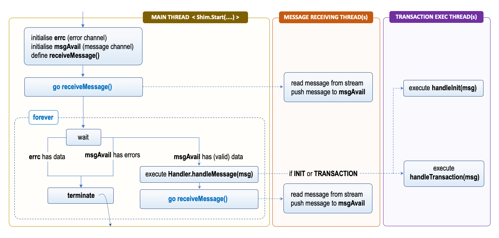

# Asynchronous Transaction Processing

## Concurrency Model

The figure shows a view of the concurrency model implemented in the shim. For the sake of simplicity the different execution paths that are run concurrently are referred as _threads_ regardless of their underlying implementation (i.e. green threads, go-routines, ..). Within this context the term is used simply to refer to a function executed concurrently with others.



There are three main threads that define the flow:

- __Main Thread__: this thread executes the entrypoint of the chaincode process, it is responsible for its initialisation and implements the infinite loop that dispatches the messages to the handler. This thread is responsible for the life-cycle of the overall process and if any unexpected error is detected in the reception of messages or the processing of proposals it terminates the process. The execution relies on two channels to: `errc` and `msgAvail` from which both incoming messages
and errors are communicated to this thread.
- __Message Receiving Thread__: this thread executes the `receiveMessage()` function which listens to the bidirectional stream established with the peer and deserialises incoming data into the form of `ChaincodeMessage` instances. These are then pushed through the `msgAvail` channel to the main thread for further processing. Both valid data and error are passed through the `msgAvail` channel.
- __Transaction Execution Thread__: this thread executes the transaction proposal simulation, either via invoking `Handler.handleInit(*ChaincodeMessage)` or `Handler.handleTransaction(*ChaincodeMessage)`.

!!! Note
    The figure does not show the scenario where the execution of the chaincode methods results in requests made to the peer. In this case there is another short lived thread that is used to send a message through the bidirectional stream. This function is implemented in the `Handler.serialSendAsync(*ChaincodeMessage,chan <- error)`, which simply executes in a go routine the `Handler.serialSend(*ChaincodeMessage)` function and pushes any error in the provided channel.

This execution model allows the chaincode process to increase the throughput of as transaction proposals are executed asynchronously thus leaving the main thread free to process other requests. Moreover, it also minimises the duration of the asychronous execution paths that operate on the bidirectional stream, since the `receiveMessage()` function only lives for the time required to process one message. This is quite relevant since the stream is used to both send and receive messages from different threads.

## Execution of Transaction Proposal

The most interesting part of the interaction flow is the execution of transaction proposal. The listing below shows the implementation of the `Handler.handleReady(...)` method, which performs the dispatch of the messages based on their type to the appropriate handler function.

```go
func (h *Handler) handleReady(msg *p.ChaincodeMessage, errc chan error) error {
   switch msg.Type {
      case pb.ChaincodeMessage_RESPONSE, pb.ChaincodeMessage_ERROR:
         if err:= h.handleResponse(msg); err != nil {
            return err
         }
         return nil
      case pb.ChaincodeMessage_INIT:
         go h.handleStubInteraction(h.handleInit, msg, errc)
         return nil

      case pb.ChaincodeMessage_TRANSACTION:
         go h.handleStubInteraction(h.handleTransaction, msg, errc)
         return nil
      default:
         return fmt.Errorf("[%s] Chaincode h cannot handle message (%s) while in state: %s", msg.Txid, msg.Type, h.state)
   }
}

```

Three different cases are handled, and only two result in the asychronous execution of the chaincode methods, while the processing of `RESPONSE` messages from the peer is managed within the same thread.

The execution of transaction proposal is managed in the `Handler.handleStubInteraction(...)` which takes a function as argument, the `ChaincodeMessage` to process, and a reference to the error channel. The responsibility of this function is primarily error management and asynchronous communication back to the peer, the processing of the message is left to the `handler` function passed as first argument. This is what differentiates the execution of the `INIT` or the `TRANSACTION` proposals.

```go
func (h *Handler) handleStubInteration(handler handleStubFunc, msg *p.ChaincodeMessage, errc chan<- error){
    resp, err:= handler(msg)
    if err != nil {
      resp = &pb.ChaincodeMessage{Type: pb.ChaincodeMessage_ERROR,
                                  Payload: []byte(err.Error(),
                                  Txid: msg.Txid,
                                  ChannelId: msg.ChannelId}
    }
    h.serialSendAsync(resp, errc)
}
```

The processing of the two types of proposals is left to the following functions:

```go
func (h *Handler) handleInit(msg *pb.ChaincodeMessage) (*pb.ChaincodeMessage, error){ ... }
func (h *Handler) handleTransaction(msg *pb.ChaincodeMessage) (*pb.ChaincodeMessage, error){ ... }
```

These function have essentially the same logic comprising the following steps:

- deserialisation (unmarshalling) of the `ChaincodeInput` instance from the `ChaincodeMessage` payload;
- creation of a new instance of the `ChaincodeStub` and configuration of the transaction context comprising of channel identifier, transaction identifier, input (i.e. `ChaincodeInput`) and signed proposal; and
- invocation of the `Chaincode.Init(ChaincodeStub)` or `Chaincode.Invoke(ChaincodeStub)` method.

If there is an invocation error the method will return a `ChaincodeMessage` of type `ERROR`, if the execution is successful it will return a message of type `COMPLETED` containing the response produced by the chaincode.
